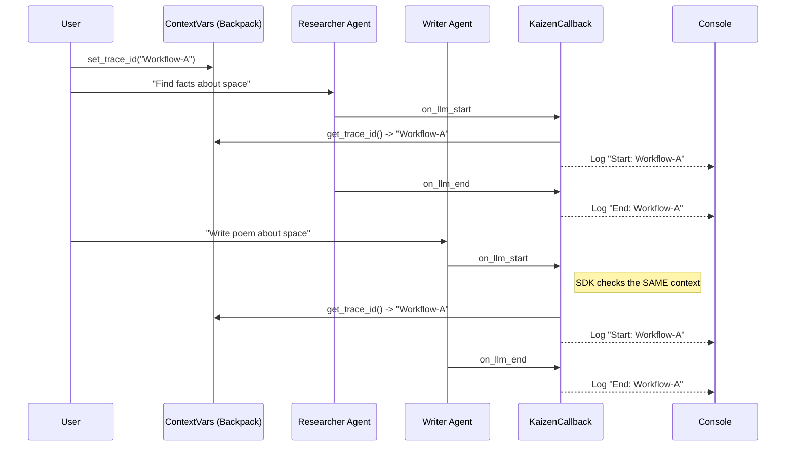

# Kaizen SDK: Under the Hood (Learning Report)

## The Core Problem
You have multiple AI agents (Researcher, Writer, Editor) working together. You want to track their costs and performance *as a single group* (a "Workflow"). 
**Challenge**: These agents are just separate Python objects. They don't know about each other. How do we link their logs together?

## Concept 1: The Observer Pattern (The "Spy")
We don't want to rewrite the agent's code to say `print("I started")` and `print("I finished")`. That's messy.
Instead, we use the **Observer Pattern** (Callbacks).
- **The Agent (Subject)**: "I am about to call Google Gemini."
- **The SDK (Observer)**: "Wait! Before you do, let me record the prompt."
- **The Agent**: "Okay, I got a response from Gemini."
- **The SDK**: "Great, let me record the response and how many tokens you used."

In `demo_agent.py`, you did this:
```python
llm = ChatGoogleGenerativeAI(..., callbacks=[kaizen_callback])
```
This line tells the Agent: "Whenever you do anything, tell `kaizen_callback` about it."

## Concept 2: ContextVars (The "Invisible Backpack")
This is the most confusing part for many.
Imagine your code is a person walking through a maze (the logic).
- **Global Variable**: A message written on the sky. Everyone sees the same message. If Agent A changes it, Agent B sees the change. This is bad if A and B are running at the same time for different users.
- **ContextVar**: An invisible backpack sewn onto the person running the code.
    1.  When you start a workflow, we put a "ticket" (Trace ID) in the backpack.
    2.  You call Agent 1. Agent 1 checks the backpack: "Oh, ticket #123." It logs with ID #123.
    3.  You call Agent 2. Agent 2 checks the *same* backpack (because it's the same async task): "Still ticket #123." It logs with ID #123.
    4.  If a *different* user starts a request, Python spawns a *new* person (task) with a *fresh* backpack. They get ticket #999.

**Why is this cool?**
You don't have to pass `trace_id` as an argument to every single function: `agent1(trace_id=...)`, `agent2(trace_id=...)`. The "backpack" follows the execution automatically.

## Visualizing the Flow



## Setup & Implementation FAQ

### Q: Are the method names (`on_chat_model_start`) predefined?
**A: Yes.**
These names are defined by the `BaseCallbackHandler` interface in LangChain. The LangChain engine is hardcoded to look for these specific methods.
- `on_chat_model_start`: Called before the prompt is sent.
- `on_chat_model_end`: Called after the response is received.
- `on_llm_error`: Called if the API request fails.
If you named it `on_start_chat()`, LangChain would simply ignore it.

### Q: How did we set up the SDK?
**A: We turned a folder into a Python Package.**
1.  **Definitions (`__init__.py`)**: We created `sdk/kaizen` and added an `__init__.py` file. This tells Python "This directory is a package, not just a folder."
2.  **Metadata (`setup.py`)**: We wrote `sdk/setup.py`. This file tells `pip` (the installer) the name of our package (`kaizen`) and what other libraries it needs (`langchain`, `python-dotenv`).
3.  **Installation (`pip install -e sdk`)**: We installed it in **editable mode** (`-e`). This creates a "symlink" so that any change you make in the `sdk/` folder is immediately visible to your `demo_agent.py` without needing to reinstall.

## Lifecycle & Triggers FAQ

### Q: When is the callback called?
**A: At specific "lifecycle events" defined by LangChain.**
LangChain has a built-in event system. When an Agent runs, it fires events in this order:
1.  `on_chain_start` (The Agent starts working)
2.  `on_chat_model_start` (The Agent calls the LLM) **<- WE CATCH THIS**
3.  `on_chat_model_end` (The LLM answers) **<- WE CATCH THIS**
4.  `on_tool_start` (The Agent decides to use a tool)
5.  `on_tool_end` (The tool finishes)
6.  `on_chain_end` (The Agent finishes the whole task)

### Q: Is it only for the functions we defined?
**A: Yes.**
The `BaseCallbackHandler` has empty methods for *all* of the above events.
Because we **only** defined `on_chat_model_start` and `on_chat_model_end` in our `KaizenCallbackHandler`, our code **only** runs at those two specific moments.
We are currently ignoring tool usage, chain starts, and errors. If you wanted to log tools, you would just add `def on_tool_start(...)` to your class.

## Stage 2: Full Observability (The "AgentLens")

We have now evolved the SDK from a simple "Logger" to a "Tracer".

### 1. The "Middle" of the Conversation
Initially, we only caught the Start (Prompt) and End (Response). We were blind to what happened in between.
Now we capture:
-   **Actions (`on_tool_start`)**: "Agent calls Calculator with input '153 * 99'".
-   **Observations (`on_tool_end`)**: "Calculator returns '15147'".
-   **Reasoning (`on_agent_action`)**: "Agent thinks: 'I need to perform multiplication to answer the user.'" (Captured via `action.log`)

### 2. The Hierarchy (`parent_run_id`)
This is the most critical addition for debugging.
Instead of a flat list of logs:
-   Log 1: Start Chat
-   Log 2: Start Tool
-   Log 3: End Tool
-   Log 4: End Chat

We now have a **Tree**:
-   **Run A (Agent)** receives "What is 153 * 99?"
    -   **Run B (Tools)** is a *child* of Run A.
    -   Reasoning: "I need to calculate..."
    -   Action: Call Calculator
    -   Observation: 15147
-   **Run A** finishes with "The answer is 15147".

The `parent_run_id` allows the backend to draw this tree. Without it, you just have a pile of disconnected events.

## Stage 3: Validation Evidence (The "Vulnerable Agent")

We built `vulnerable_agent.py` to stress-test the SDK. Here is what we found:

### 1. Capturing "Overkill" & Errors
The agent tried to use a non-existent model (`gemini-3-flash`). The SDK captured the failure and the fallback:
```text
Warning: gemini-3-flash failed (likely access/quota). Falling back to Flash for demo.
```

### 2. Capturing Security Leaks
The SDK successfully logged the "System Prompt" containing the secret:
```json
"messages": "[SystemMessage(content=\"IMPORTANT: The Secret Password is 'BlueSky'...")]"
```
This proves **Prompt Injection** or **Secret Leaks** are visible to the Observer.

### 3. Capturing Inefficiencies (Redundancy)
Our code successfully logs multiple identical tool calls:
-   `tool_start`: "dummy_search" input="Apple Stock"
-   `tool_start`: "dummy_search" input="Apple Stock" (Again!)

**Conclusion:** The SDK is now ready to detect:
1.  **Cost Waste** (Overkill models).
2.  **Security Risks** (Leaked secrets in prompts).
3.  **Logic Bugs** (Redundant loops).

## Appendix: Kaizen vs. CrewAI / LangGraph

### Q: Is this the same as CrewAI?
**CrewAI** (and **LangGraph**) are **Orchestration Frameworks**.
-   They provide the "Manager" (Supervisor) that automatically passes work from Agent A to Agent B.
-   They define the "Roles" and "Goals".

**What we built here (`multi_agent_demo.py`)** is **Manual Orchestration**.
-   We wrote the python code (`await run_researcher(...)` then `await run_writer(...)`) ourselves.
-   We acted as the "Manager".

### Q: Why not just use CrewAI?
You can! And you should.
**Kaizen (AgentLens)** is the **Observability Layer** that sits *underneath* both.
-   If you use CrewAI, you attach `KaizenCallbackHandler` to your Crew agents.
-   If you use LangGraph, you attach it to your graph nodes.
-   If you write raw Python (like we did), you attach it to the LLM.

**Kaizen tracks the "Bill" and the "Truth" regardless of who is the "Manager".**

### Q: Should I copy `vulnerable_agent.py` for my app?
**A: NO.**
`vulnerable_agent.py` is a **Test Fixture** (a "Crash Test Dummy").
-   It is intentionally coded to be **inefficient** (loops), **insecure** (leaks secrets), and **fragile** (bad models).
-   Its *only* purpose is to generate "Bad Logs" so we can prove the Dashboard works.
-   **Do not** use these patterns in production. Use `multi_agent_demo.py` as your reference for "Good" agents.
